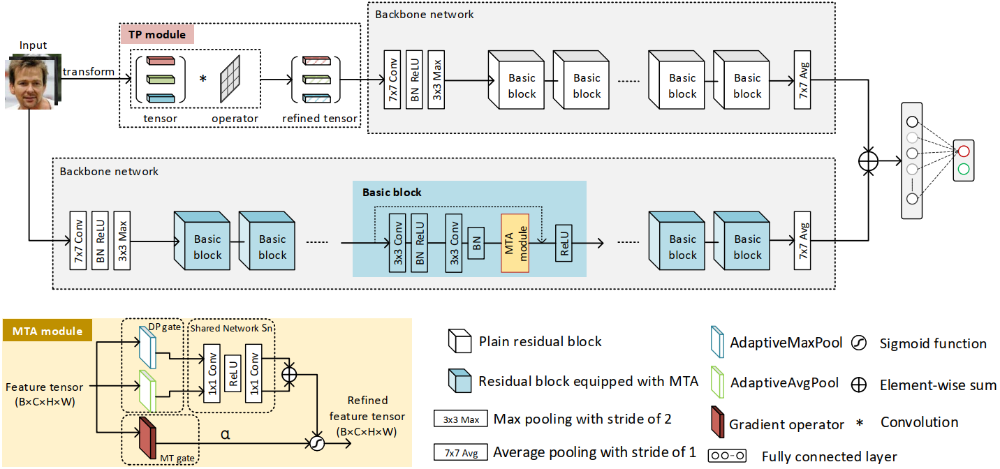

# Rethinking Gradient Operator for Exposing AI-enabled Face Forgeries

Zhiqing Guo1, 
Gaobo Yang1,
Dengyong Zhang2,
and Ming Xia1 
1 Hunan University, China; 
2 Changsha University of Science and Technology, China 

## GocNet
For image forensics, convolutional neural networks (CNNs) tend to learn image content features rather than subtle manipulation traces, which constrains detection performance. Existing works usually address this issue by following a common pipeline, namely subtracting the original pixel value from the predicted pixel value to enforce CNNs to learn more features from the manipulation traces. However, due to the complicated learning mechanism, they might still have some unnecessary performance losses. In this work, we rethink the advantages of image gradient operator in exposing AI-enabled face forgeries, and design two plug-and-play modules, namely tensor pre-processing (TP) and manipulation trace attention (MTA), by combining the gradient operator with CNNs. Specifically, the TP module refines the feature tensor of each channel in the network by the gradient operator to highlight manipulation traces and improve feature representation. Moreover, the MTA module considers two dimensions, namely channel and manipulation traces, to enforce the network to learn the distribution of the manipulation traces. Both modules can be seamlessly integrated into existing CNNs for end-to-end training. Experiments show that the proposed expert system achieves better results than prior works on five public image datasets.

## Update
- Requirements
- Usage
- Code
